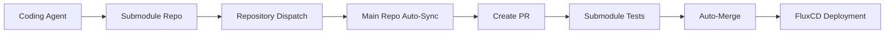

# Submodule Auto-Sync Setup

This document explains how to set up automatic synchronization between submodule repositories and the main GitOps workflow.

## How It Works



1. **Coding agent** commits to submodule repository
2. **Submodule repo** triggers repository dispatch to main repo
3. **Main repo** receives dispatch and updates submodule references
4. **Auto-sync workflow** creates PR with submodule updates
5. **GitOps pipeline** takes over (testing → auto-merge → deployment)

## Required Setup in Submodule Repositories

Add this workflow to each submodule repository to trigger auto-sync in the main repo:

### File: `.github/workflows/notify-main-repo.yml`

```yaml
name: Notify Main Repository

on:
  push:
    branches:
      - main
  workflow_dispatch:

permissions:
  contents: read

jobs:
  notify-main-repo:
    runs-on: ubuntu-latest
    steps:
      - name: Checkout
        uses: actions/checkout@v4

      - name: Get commit information
        id: commit-info
        run: |
          echo "commit_sha=${{ github.sha }}" >> $GITHUB_OUTPUT
          echo "commit_message<<EOF" >> $GITHUB_OUTPUT
          git log -1 --pretty=format:"%s" >> $GITHUB_OUTPUT
          echo "" >> $GITHUB_OUTPUT
          echo "EOF" >> $GITHUB_OUTPUT
          
          # Extract submodule name from repository name
          REPO_NAME="${{ github.repository }}"
          SUBMODULE_NAME="${REPO_NAME##*/}"
          echo "submodule_name=$SUBMODULE_NAME" >> $GITHUB_OUTPUT

      - name: Trigger main repository sync
        run: |
          echo "🔔 Notifying main repository of submodule update..."
          echo "Repository: ${{ github.repository }}"
          echo "Commit: ${{ steps.commit-info.outputs.commit_sha }}"
          echo "Message: ${{ steps.commit-info.outputs.commit_message }}"
          
          curl -L \
            -X POST \
            -H "Accept: application/vnd.github+json" \
            -H "Authorization: Bearer ${{ secrets.MAIN_REPO_TOKEN }}" \
            -H "X-GitHub-Api-Version: 2022-11-28" \
            https://api.github.com/repos/dblitz-com/gengine/dispatches \
            -d '{
              "event_type": "submodule-updated",
              "client_payload": {
                "submodule_name": "${{ steps.commit-info.outputs.submodule_name }}",
                "submodule_repo": "${{ github.repository }}",
                "commit_sha": "${{ steps.commit-info.outputs.commit_sha }}",
                "commit_message": "${{ steps.commit-info.outputs.commit_message }}",
                "triggered_by": "${{ github.actor }}",
                "ref": "${{ github.ref }}"
              }
            }'
            
          echo "✅ Main repository notified successfully"
        env:
          # This token needs to be added to each submodule repo's secrets
          # It should have 'repo' scope to trigger repository_dispatch events
          MAIN_REPO_TOKEN: ${{ secrets.MAIN_REPO_TOKEN }}

      - name: Summary
        run: |
          echo "🎉 Submodule Update Notification Summary:"
          echo "✅ Main repository (gengine) has been notified"
          echo "✅ Auto-sync workflow will trigger in main repo"
          echo "✅ GitOps pipeline will handle deployment"
          echo ""
          echo "📋 Next Steps (automatic):"
          echo "  1. Main repo updates submodule reference"
          echo "  2. Creates PR with submodule changes"
          echo "  3. Runs submodule tests"
          echo "  4. Auto-merges after tests pass"
          echo "  5. FluxCD deploys to staging"
```

## Required GitHub Token Setup

Each submodule repository needs a GitHub token with repository dispatch permissions:

### 1. Create GitHub Token
- Go to GitHub Settings → Developer settings → Personal access tokens → Fine-grained tokens
- Create token with these permissions for the main repository (`dblitz-com/gengine`):
  - **Repository permissions:**
    - `Actions: write` (to trigger workflows)
    - `Metadata: read` (basic repo access)

### 2. Add Token to Submodule Repository Secrets
- Go to submodule repo → Settings → Secrets and variables → Actions
- Add new repository secret:
  - **Name:** `MAIN_REPO_TOKEN`
  - **Value:** (the GitHub token created above)

## Submodule Repositories to Configure

Add the workflow above to these repositories:

1. **gengine-rest-api-to-mcp**
   - Repository: `dblitz-com/gengine-rest-api-to-mcp`
   - Path: `src/gengines/gengine-rest-api-to-mcp`

2. **gengine-mcp-catalog**
   - Repository: `dblitz-com/gengine-mcp-catalog`
   - Path: `src/gengines/gengine-mcp-catalog`

## Testing the Setup

### Manual Test
1. Go to main repository → Actions → "Submodule Auto-Sync"
2. Click "Run workflow" → "Manual trigger"
3. Verify it creates a PR with latest submodule updates

### Automated Test
1. Make a test commit to any submodule repository
2. Verify the notify workflow runs in the submodule repo
3. Verify the auto-sync workflow triggers in the main repo
4. Verify a PR is created with the submodule update

## Troubleshooting

### Repository Dispatch Not Triggering
- Check that `MAIN_REPO_TOKEN` secret exists in submodule repo
- Verify token has correct permissions (`Actions: write`)
- Check workflow logs in submodule repo for API errors

### Auto-Sync Workflow Not Running
- Verify repository dispatch event type is `submodule-updated`
- Check main repo Actions tab for triggered workflows
- Review payload format in submodule notification workflow

### Submodule Update Fails
- Check that submodule repositories are accessible
- Verify Git configuration in auto-sync workflow
- Check for merge conflicts in submodule updates

## Benefits

✅ **Automatic GitOps Flow:** Coding agent changes flow through complete pipeline  
✅ **Proper Testing:** All submodule changes go through testing workflows  
✅ **Branch Protection:** Changes require passing status checks  
✅ **Deployment Automation:** FluxCD handles staging/production deployment  
✅ **Audit Trail:** All changes tracked via PR and commit history  
✅ **Rollback Capability:** Easy rollback via Git history  

## Architecture Notes

- **Decoupled:** Submodule repos only need to send dispatch events
- **Secure:** Uses GitHub tokens with minimal required permissions  
- **Scalable:** Easy to add more submodule repositories
- **Reliable:** Built on GitHub's repository dispatch mechanism
- **Observable:** Full audit trail and workflow visibility