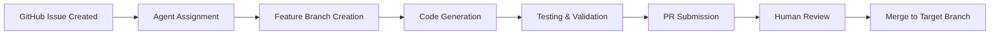

# Agentic Coding Deployment Strategy

Based on comprehensive research of industry best practices, this document outlines deployment flows and strategies for implementing agentic coding where AI agents autonomously handle issues, create branches, write code, and submit pull requests.

## 🎯 Core Workflow Architecture

### 1. Issue-to-PR Agentic Flow



**Key Components:**
- **Issue Templates**: Structured with clear acceptance criteria, context, and constraints
- **Agent Allocation**: Based on issue labels, complexity, and agent capabilities
- **Automated Testing**: Every agent-generated change passes through CI/CD
- **Human Oversight**: Final merge approval remains with human maintainers

## 🌳 Recommended Branch Strategies

### Trunk-Based Development with Agent Feature Branches

```
main (trunk)
├── agent/issue-123-refactor-auth
├── agent/issue-124-add-logging
├── agent/issue-125-fix-validation
└── agent/issue-126-update-docs
```

**Benefits:**
- Short-lived branches minimize conflicts
- Clear naming convention for agent branches
- Easy to track agent activities
- Supports parallel agent development

### Environment Mapping

```yaml
Branch Mapping:
  main → production
  staging → staging environment
  dev → development environment
  agent/* → ephemeral test environments
```

## 🤖 Multi-Agent Orchestration Patterns

### 1. Coordinator Pattern (Recommended for Starting)

```
┌─────────────────┐
│   Coordinator   │
│     Agent       │
└────────┬────────┘
         │
    ┌────┴────┬──────────┬──────────┐
    ▼         ▼          ▼          ▼
┌─────────┐┌─────────┐┌─────────┐┌─────────┐
│ Coder   ││ Tester  ││Reviewer ││  Docs   │
│ Agent   ││ Agent   ││ Agent   ││ Agent   │
└─────────┘└─────────┘└─────────┘└─────────┘
```

### 2. Issue Labeling System

```yaml
Priority Labels:
  - P0-critical    # Immediate agent attention
  - P1-high        # Next in queue
  - P2-medium      # Standard priority
  - P3-low         # Background tasks

Capability Labels:
  - lang:python    # Python specialist agent
  - lang:typescript # TypeScript specialist
  - type:refactor  # Refactoring agent
  - type:testing   # Test writing agent
  - type:docs      # Documentation agent
  - complexity:low # Junior agent capable
  - complexity:high # Senior agent required
```

### 3. Agent Specialization Matrix

| Agent Type | Specialization | Capabilities | Issue Types |
|------------|----------------|--------------|-------------|
| Frontend Agent | UI/UX, React, CSS | Component creation, styling | `frontend`, `ui-bug` |
| Backend Agent | APIs, databases | Service logic, data models | `backend`, `api` |
| Test Agent | Unit/Integration tests | Test generation, coverage | `testing`, `quality` |
| Security Agent | Vulnerability scanning | Security patches | `security`, `audit` |
| Refactor Agent | Code optimization | Clean code, performance | `tech-debt`, `refactor` |

## 🔒 Security & Infrastructure Requirements

### 1. Sandbox Architecture

```yaml
Agent Sandbox:
  - Isolated container/VM per agent
  - Resource quotas:
    - CPU: 2 cores max
    - Memory: 4GB max
    - Disk: 10GB max
    - Network: Rate limited
  - No access to:
    - Production databases
    - Secrets/credentials
    - Internal networks
```

### 2. Permission Model

```yaml
Agent Permissions:
  Repository:
    - Read: ✓ (all branches)
    - Write: ✓ (agent/* branches only)
    - Delete branches: ✓ (own branches only)
    - Create PR: ✓
    - Merge PR: ✗ (human only)
  
  CI/CD:
    - Trigger builds: ✓
    - View logs: ✓
    - Deploy: ✗
```

### 3. Monitoring & Controls

```yaml
Monitoring:
  - Real-time agent activity dashboard
  - Resource usage tracking
  - Code generation metrics
  - Error/failure rates
  
Cost Controls:
  - Daily token limits per agent
  - Automatic shutdown on budget exceed
  - Resource usage alerts
  
Security:
  - Static code analysis on all PRs
  - Dependency vulnerability scanning
  - Malicious pattern detection
  - Audit logs for all actions
```

## 📊 Implementation Phases

### Phase 1: Pilot (Weeks 1-4)
- Single agent handling documentation updates
- Manual issue assignment
- Human review all outputs
- Measure: Time saved, quality metrics

### Phase 2: Expansion (Weeks 5-12)
- 3-5 specialized agents
- Automated issue assignment via labels
- Agent-to-agent handoffs
- Measure: Throughput, conflict rates

### Phase 3: Scale (Weeks 13+)
- Full agent orchestra
- Complex multi-agent workflows
- Autonomous issue resolution
- Measure: End-to-end velocity

## ⚠️ Common Pitfalls to Avoid

1. **Over-automation**: Start small, automate incrementally
2. **Insufficient oversight**: Always maintain human review gates
3. **Poor issue definition**: Invest in clear templates and guidelines
4. **Resource runaway**: Implement hard limits and monitoring
5. **Security shortcuts**: Never compromise on sandboxing
6. **Ignoring conflicts**: Plan for merge conflict resolution

## 📈 Success Metrics

### Productivity Metrics
- **Time to PR**: Measure issue → PR completion time
- **PR Quality**: Track review cycles, rejection rates
- **Coverage**: % of issues handled by agents
- **Throughput**: PRs merged per week

### Quality Metrics
- **Bug Introduction Rate**: New bugs per agent PR
- **Test Coverage**: Maintained or improved
- **Code Review Feedback**: Human corrections needed
- **Documentation Quality**: Completeness scores

## 🚀 Getting Started Checklist

- [ ] Set up protected branches (main, staging, dev)
- [ ] Create issue label taxonomy
- [ ] Deploy agent sandbox infrastructure
- [ ] Configure CI/CD for agent branches
- [ ] Implement monitoring dashboard
- [ ] Create agent permission groups
- [ ] Define issue templates
- [ ] Set up cost tracking
- [ ] Train team on agent workflows
- [ ] Start with pilot agent

## 💡 Best Practices Summary

1. **Start Small**: Begin with low-risk, high-volume tasks
2. **Human Oversight**: Maintain review gates at critical points
3. **Clear Boundaries**: Define what agents can and cannot do
4. **Continuous Learning**: Iterate based on metrics and feedback
5. **Security First**: Never compromise on isolation and controls
6. **Tool Integration**: Leverage existing GitHub/GitLab features
7. **Documentation**: Track all agent activities and decisions

## 🔗 Integration with Existing Workflow

```yaml
Developer Workflow:
  1. Create issue with proper labels
  2. Agent picks up based on capabilities
  3. Agent creates feature branch
  4. Agent implements solution
  5. Agent creates PR with details
  6. Developer reviews and provides feedback
  7. Agent iterates based on feedback
  8. Developer approves and merges
  
Webhook Integration:
  - Issue created → Trigger agent assignment
  - PR created → Trigger automated tests
  - PR approved → Trigger deployment pipeline
  - Merge complete → Close issue, cleanup
```

This strategy provides a comprehensive framework for implementing agentic coding while maintaining security, quality, and human oversight. Start with Phase 1 and expand based on success metrics and team comfort level.